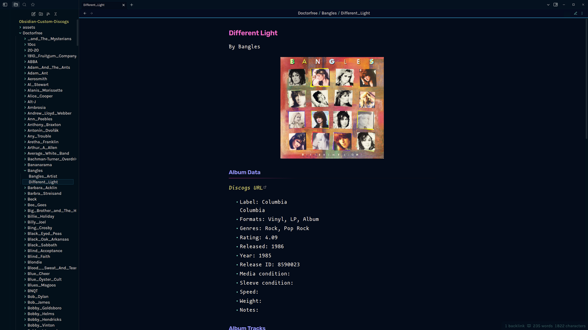
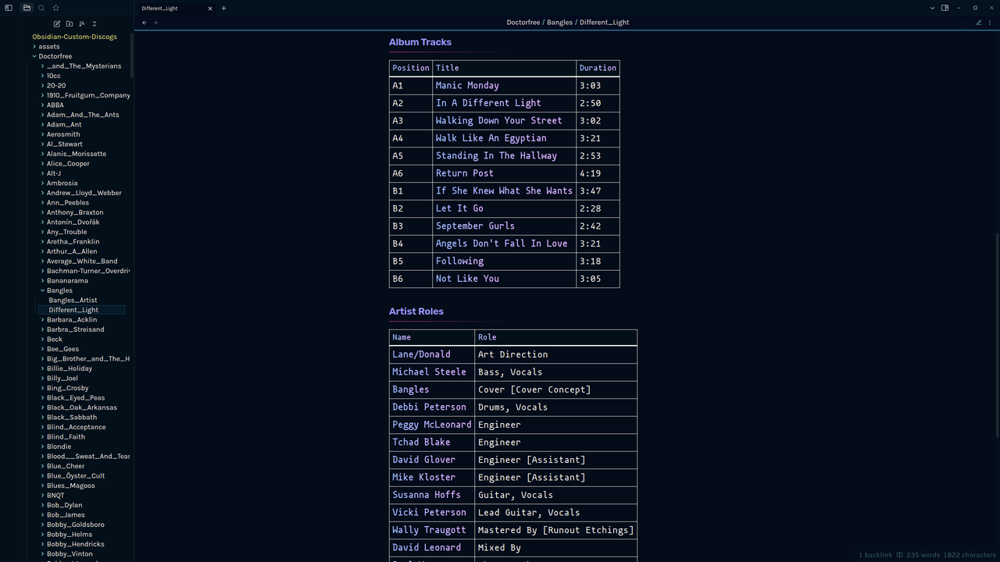
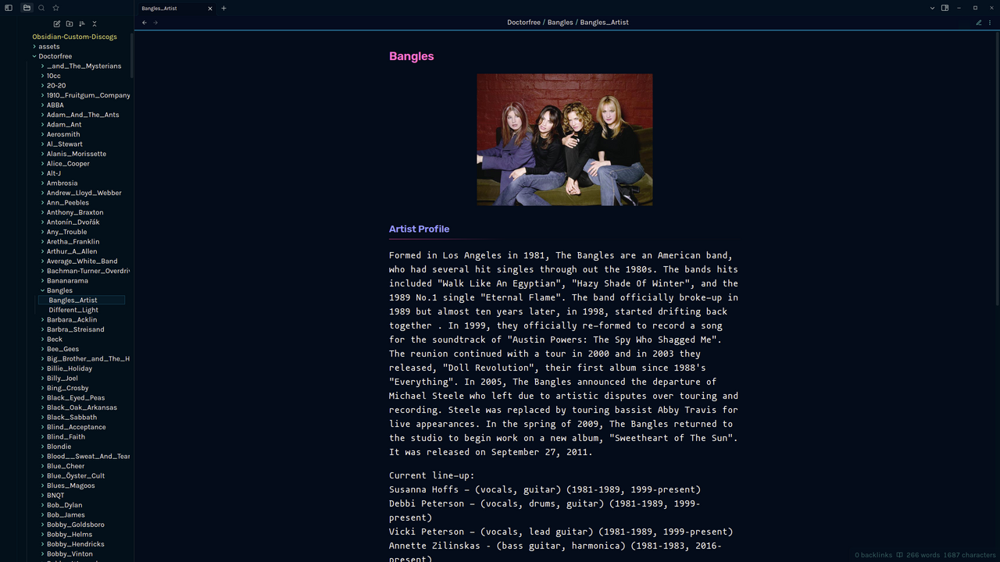
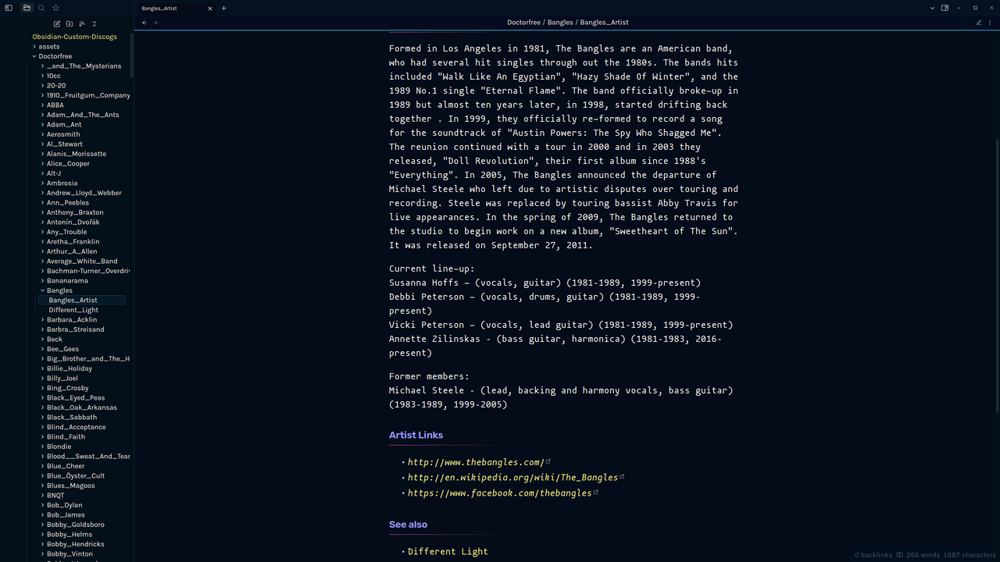

# Obsidian Discogs Vault

The Obsidian Custom Discogs repository provides an automated workflow to generate markdown format files from [Discogs](https://discogs.com) user collections and local music libraries using the Discogs API.

Command line support for automated procedures to:

- ***Generate markdown from a Discogs user collection***
- ***Generate markdown from a local music library***
- ***Add releases from markdown to a Discogs collection folder***
- ***Remove releases from a Discogs collection folder***

Discogs (short for discographies) is a database of information about audio recordings, including commercial releases, promotional releases, and bootleg or off-label releases.  As of 19 November 2022, Discogs contains over 15.7 million releases, by over 8.3 million artists, across over 1.9 million labels, contributed from over 644,000 contributor user accounts - with these figures constantly growing as users continually add previously unlisted releases to the site over time.

The automated workflow provided in this repository utilizes the Discogs API to access this rich source of data on music releases and artists, retrieve it, and transform it into a format suitable for human consumption and display.

The repository is organized as an Obsidian vault designed to generate artist/album/track descriptions from a Discogs collection or a local music library. It can be viewed using any markdown viewer (e.g. almost any browser) but if Obsidian is used then many additional features will be available including queries using the [Dataview](https://blacksmithgu.github.io/obsidian-dataview/) plugin for [Obsidian](https://obsidian.md/).

See the [description of Process](Process.md) for an overview of the process and tools employed in the use of this repository.

## Table of Contents

- [Quickstart](#quickstart)
- [Requirements](#requirements)
- [Setup](#setup)
- [Usage](#usage)
- [Dataview](#dataview)
- [Discogs](#discogs)
- [Process](#process)
- [Screenshots](#screenshots)
- [Obsidian Plugins](#obsidian_plugins)
- [See also](#see_also)

## Quickstart

- [Download the vault](https://github.com/doctorfree/Obsidian-Custom-Discogs/archive/refs/tags/v1.0.2r2.tar.gz)
- Extract the vault: `tar xf /path/to/Obsidian-Custom-Discogs-1.0.2r2.tar.gz`
- Set the Discogs username (`DISCOGS_USER`) and API token (`DISCOGS_TOKEN`) in `$HOME/.config/mpprc`
- Customize the vault by running `./Setup` in the vault folder:
    - `./Setup` for a Discogs user collection
    - `./Setup -L /path/to/library` for a local music library
- Open the vault in Obsidian via "Open another vault -> Open folder as vault"

## Requirements

In order to use the download, conversion, creation, and curation process utilized by the Obsidian Custom Discogs project a [Discogs](https://discogs.com) account and Discogs API token are required. Account creation can be performed at https://discogs.com by providing a username, password, and email address. After verifying new account creation via email, obtain an API token by logging in to your Discogs account and clicking `Settings -> Developers`. Click the `Generate new token` button and copy the generated token.

Your Discogs username and API token are required to perform some of the API requests sent during the automated vault creation process. See the following section for details on how to configure your system with these credentials.

In addition to the standard Unix/Linux utilities, the download and conversion tools require `curl` and `jq`. On most Linux systems these are either pre-installed or can be installed by a system administrator with `sudo apt install curl` or `sudo dnf install curl` and `sudo apt install jq` or `sudo dnf install jq`.

## Setup

The Discogs API requires a Discogs username and Discogs API token. These can be found in your Discogs account and placed in the file `$HOME/.config/mpprc` as follows:

```shell
# The Discogs username can be found by visiting discogs.com. Login, use the
# dropdown of your user icon in the upper right corner, click on 'Profile'.
# Your Discogs username is the last component of the profile URL. IF you do
# not have a Discogs account, leave blank.
DISCOGS_USER="your_discogs_username"
# The Discogs API token can be found by visiting
# https://www.discogs.com/settings/developers
DISCOGS_TOKEN="your_discogs_api_token"
```

After configuring your Discogs username and API token, generate markdown for your Discogs collection or from a local music library by running the `Setup` script.

To generate artist, album, and track markdown from your Discogs user collection:

```console
./Setup
```

To generate artist, album, and track markdown from a local music library:

```console
./Setup -L /path/to/library
```

Alternately, the Discogs username and API token can be specified on the command line:

```console
./Setup -u username -t token [ -L /path/to/library ]
```

**[Note:]** To generate markdown from a local music library, the library must be organized by artist subfolders containing album folders. For example, the tracks from the album "Imagine" by John Lennon would be in the folder `/path/to/library/John Lennon/Imagine/`. If you prefer pathnames without spaces, use an underscore in place of spaces and the markdown generation scripts will perform the appropriate transformation when searching Discogs (e.g. `/path/to/library/John_Lennon/Imagine/` would work).

The resulting markdown and cover art from a Discogs user collection can be found in the `Username` and `assets` folders where `Username` is your capitalized Discogs username. Multiple Discogs collections from different Discogs users can be converted to markdown in the vault by running the `Setup` script multiple times with different `-u username` arguments.

For example, to generate markdown for the items and artists in Discogs user Dr_Robert's collection, run the following:

```console
./Setup -u Dr_Robert
```

The markdown and cover art can be found in the `Dr_Robert` and `assets` folders.

The markdown and cover art generated from a local music library can be found in the `Music_Library` and `assets` folders. Multiple local libraries from different folder paths can be converted to markdown in the vault by running the `Setup` script multiple times with different `-L /path/to/library` arguments and by providing different vault names for each library with the `-v vault` command line option.

For example, to generate markdown for the albums and artists in `/u/audio/jazz` and name the markdown output folder `Jazz`, run the following:

```console
./Setup -L /u/audio/jazz -v Jazz
```

**[Note:]** For large Discogs collections or local music libraries this process can take a while. Discogs throttles API requests to prevent denial of service attacks. I have tried to minimize API requests where possible but if you see any way to further optimize please [open an issue](https://github.com/doctorfree/Obsidian-Custom-Discogs/issues).

## Usage

### **For the optimal experience, open this vault in Obsidian!**

1. [Download the vault](https://github.com/doctorfree/Obsidian-Custom-Discogs/releases/latest)
3. Open the vault in Obsidian via "Open another vault -> Open folder as vault"
4. Trust us. :) 
5. When Obsidian opens the settings, verify the "Dataview" plugin is enabled
6. Done! The Obsidian Custom Discogs vault is now available to you in its purest and most useful form.

### Setup usage

The `Setup` command has the following output from `Setup -h`:

```console
Usage: ./Setup [-L /path/to/library] [-A] [-f foldername] [-v vault] [-R] [-U] [-t token] [-u user] [-ehnqr]
Where:
	-A indicates add existing vault folder releases to a Discogs collection
	-R indicates remove items from specified Discogs collection folder
		Must be accompanied by '-f foldername'
	-L 'path' indicates use a local music library rather than Discogs collection
	-U indicates perform an update of the Discogs collection
		Vault folder is specified with '-v vault'
		Vault folder previously created with './Setup -L /path/to/library'
		Can be used with '-f foldername' to specify collection folder
	-f 'foldername' specifies the Discogs collection folder name to use.
		Only used in conjunction with '-A' (add releases to Discogs collection).
		If no folder by this name exists, one will be created.
		Default: Uncategorized
	-e displays example usage and exits
	-n indicates perform a dry run (only used in conjunction with '-A')
	-q indicates quiet mode (only used in conjunction with '-A')
	-r indicates remove intermediate JSON created during previous run
	-t 'token' specifies the Discogs API token
	-u 'user' specifies the Discogs username
	-v 'vault' specifies the folder name for generated artist/album markdown
	-h displays this usage message and exits
```

Example invocations of the `Setup` command can be displayed with `./Setup -e`:

```console
Example invocations:
	# Retrieve Discogs collection
	# Generated markdown in capitalized Discogs username folder
	./Setup
	# Generated markdown in 'Discogs' folder
	./Setup -v Discogs
	# Retrieve Discogs user 'foobar' collection
	./Setup -u foobar
	# Retrieve Discogs data for local music library in /u/audio
	./Setup -L /u/audio -v Audio
	# Provide Discogs username and API token on command line
	./Setup -L ~/Music -u doctorfree -t xyzkdkslekjrelrkek
	# Retrieve Discogs data for genre local music library in /u/jazz
	./Setup -L /u/jazz -v Jazz
	# Add existing vault releases to Discogs collection folder
	# From a previously generated run of './Setup -L /path/to/library'
	# Perform a dry run:
	./Setup -n -A -f MyMusic -v Music_Library
	# Add releases from Music_Library folder to Discogs collection MyMusic:
	./Setup -A -f MyMusic -v Music_Library
	# Delete releases in MyMusic Discogs collection folder:
	./Setup -R -f MyMusic
```

## Dataview

The Obsidian Custom Discogs vault has been curated with metadata allowing queries to be performed using the Obsidian Dataview plugin. Sample queries along with the code used to perform them can be viewed in the [Dataview Queries](Dataview_Queries.md) document and the generated Dataview markdown in the `Dataviews` folder.

Additional visual representations of the Custom Discogs Vault, also based upon Dataview queries, are provided by the [Excalibrain](https://github.com/zsviczian/excalibrain) Obsidian plugin.

The Obsidian Custom Discogs vault markdown contains metadata with tags allowing a variety of Obsidian Dataview queries.

## Discogs

[Discogs](https://www.discogs.com) users with curated Discogs collections can generate markdown format files for all items and artists in their Discogs collection using the Discogs API. See [Process.md](Process.md) for details on how to automate this process.

**[NEW FEATURE]** Obsidian Custom Discogs now supports adding vault items to a Discogs user collection. After generating an Obsidian Custom Discogs vault from a local music library, the resulting markdown can be used to add those albums and artists to your Discogs collection.

To add albums and artists to a Discogs user collection, cd into the `Tools/Discogs` folder and run the `albums2discogs` command. For example, if `Setup -L /path/to/library` were previously run and the vault folder `Music_Library` created with generated markdown for the artists, albums, and tracks in `/path/to/library` then those artists and albums can be added to a Discogs user collection folder with:

```shell
cd Tools/Discogs
./albums2discogs -h  # Display the help message
./albums2discogs -n -v Music_Library -f "Music Library"  # Perform a dry-run
./albums2discogs -q -v Music_Library -f "Music Library"
```

You can examine the source code for the [albums2discogs command](Tools/Discogs/albums2discogs.md).

## Process

See the [Process](Process.md) document for a detailed description of the tools and process used to generate this vault.

## Screenshots

### Example album release generated markdown





### Example artist profile generated markdown





## Obsidian_Plugins

Obsidian community plugins we have found useful and can recommend include the following:

- [Contextual Typography](https://github.com/mgmeyers/obsidian-contextual-typography): Enables enhanced preview typography
- [Dataview](https://github.com/blacksmithgu/obsidian-dataview): Treats an Obsidian Vault as a database from which you can query
- [Excalibrain](https://github.com/zsviczian/excalibrain): An interactive structured mind-map of an Obsidian vault
- [Excalidraw](https://github.com/zsviczian/obsidian-excalidraw-plugin): Edit and view Excalidraw in Obsidian
- [Hider](https://github.com/kepano/obsidian-hider): Hides various elements of the UI
- [Hover-editor](https://github.com/nothingislost/obsidian-hover-editor): Turns the hover popover into a full featured editor
- [Pandoc](https://github.com/OliverBalfour/obsidian-pandoc): Adds command palette options to export your notes to a variety of formats
- [Quickadd](https://github.com/chhoumann/quickadd): Quickly add content to a vault
- [Shellcommands](https://github.com/Taitava/obsidian-shellcommands): Define and run shell commands
- [Style Settings](https://github.com/mgmeyers/obsidian-style-settings): Enables theme customization
- [Templater](https://github.com/SilentVoid13/Templater): Defines a powerful templating language

## See_also

- [Dataview Queries](Dataview_Queries.md)
- [Process](Process.md)
- Additional Obsidian vaults I have curated and made public include:
    - [Obsidian Beets Vault](https://github.com/doctorfree/Obsidian-Beets-Vault)
    - [Obsidian Books Vault](https://github.com/doctorfree/Obsidian-Books-Vault)
    - [Obsidian CD Vault](https://github.com/doctorfree/Obsidian-CD-Vault)
    - [Obsidian Discogs Vault](https://github.com/doctorfree/Obsidian-Discogs-Vault)
    - [Obsidian Roon Vault](https://github.com/doctorfree/Obsidian-Roon-Vault)
    - [Obsidian Vinyl Vault](https://github.com/doctorfree/Obsidian-Vinyl-Vault)
    - [Obsidian Media Vault](https://github.com/doctorfree/Obsidian-Media-Vault)
    - [Pokemon Markdown Vault](https://github.com/doctorfree/Pokedex-Markdown)
